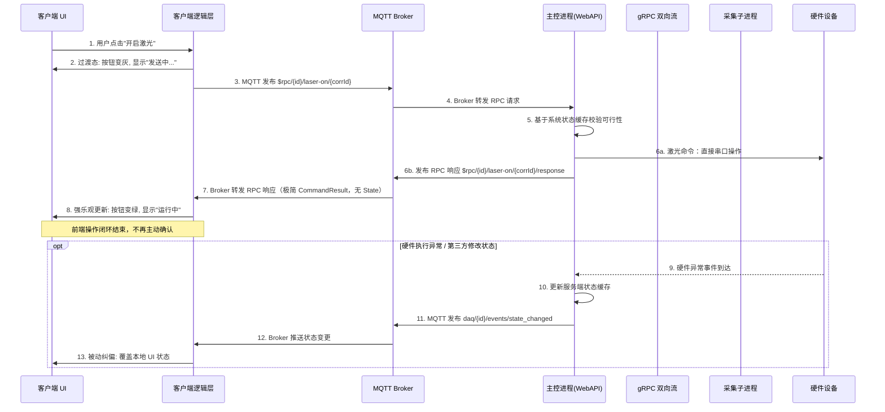
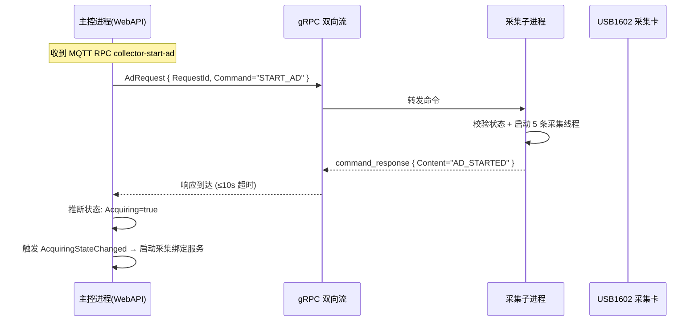
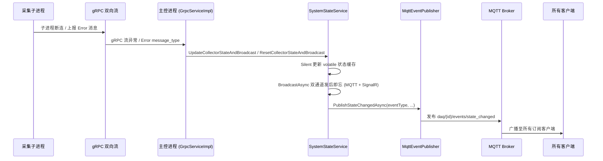

# 前后端交互逻辑：强乐观模式（MQTT 版）

## 概述

本方案针对硬件控制场景，提出一种**强乐观 UI 更新**与**后端缓存校验**相结合的前后端交互模式。核心思想是：前端通过 MQTT RPC 发出命令后，一旦收到"命令已受理"的确认，立即乐观地更新 UI 至目标状态，不再主动轮询确认；后端通过实时状态缓存验证命令可行性，并借助 MQTT 事件广播机制确保多客户端状态的最终一致性。

**V2.0 变更**：命令下发从 HTTP REST 全面迁移至 MQTT RPC（`$rpc/{MachineId}/{方法名}/{关联ID}`）；状态推送从 SignalR 迁移至 MQTT 事件主题（`daq/{MachineId}/events/state_changed`）。SignalR 通道降级为兼容层，不再作为交互逻辑的主通道。

该模式旨在解决传统同步等待模式下的用户体验迟滞、网络超时盲区、服务端性能损耗及多客户端状态同步等问题。

## 交互流程总览

### 主序列图：命令下发与乐观更新



### 子图：采集命令的 gRPC 转发路径

采集卡命令（如 `collector-start-ad`）与激光命令不同——主控进程不直连硬件，而是通过 gRPC 双向流转发至采集子进程：



> **命令路径区分**：激光命令由主控进程直接操作物理串口（同主机），采集命令通过 gRPC 双向流代理至子进程。两种路径在本文定义的"强乐观"交互模式中无差异——前端均等待 MQTT RPC 响应后乐观更新。

### 子图：state_changed 事件的完整推送链



## 各阶段详细说明

### 阶段一：用户触发与前端过渡态（步骤 1-2）

- **用户动作**：在客户端 UI 上点击控制按钮（如"开启激光"、"开始采集"）。
- **前端响应**：
  - 客户端逻辑层立即将按钮置为**过渡态**（如：按钮变灰，显示"发送中..."）。
  - 此状态仅表示"MQTT RPC 请求已发出，正在等待响应话题的回复"，**不表示正在等待硬件执行**。
- **设计意图**：防止用户重复点击，提供即时视觉反馈。

### 阶段二：MQTT RPC 路由与后端校验（步骤 3-5）

- **MQTT 发布**：前端发布至 `$rpc/{MachineId}/{方法名}/{关联ID}`，QoS=1，`{关联ID}` 由前端生成（如 GUID）。
- **Broker 转发**：MQTT Broker 将请求转发至已订阅 `$rpc/{MachineId}/#` 的主控进程。
- **服务端路由**：`MqttRpcBackgroundService` 解析 topic 中的 `{方法名}`，查路由表分发至对应 Handler（`LaserHandler` / `CollectorHandler` / `SystemHandler` 等）。
- **服务端校验**：
  - Handler 查询 `SystemStateService` 的**系统状态缓存**（volatile 不可变替换，纯内存操作）。
  - 校验当前设备状态是否允许执行该命令（例如：设备是否已就绪、是否被占用等）。
  - 若校验不通过，立即发布 RPC 错误响应（`Success=false`），前端恢复按钮至初始态。
- **未知方法处理**：若方法名不在路由表中，返回 `{"success":false,"code":"UNKNOWN_METHOD",...}`。

### 阶段三：命令执行与极简 RPC 响应（步骤 6a-7）

#### 激光命令（直连串口）

- **执行路径**：主控进程 → `CniLaser` 直接操作物理串口。
- **关键方法**：`laser-on` → `SetPower()` + `SetFrequency()` + `LaserOn()`（十六进制指令帧协议）；`laser-off` → `LaserOff()`。
- **执行后**：`CniLaser` 调用 `SystemStateService.UpdateLaserStateSilent()` 更新内存缓存（路径 [A]，不广播）。
- **响应**：Handler 返回不带 `state` 字段的 `CommandResult` JSON。

> **⚠️ 实现缺口**：当前 `CniLaser` 中 MQTT `state_changed` 推送调用已被注释掉，激光状态变更不会主动广播。详情见 [激光状态推送缺口](#激光状态推送缺口)。

#### 采集命令（gRPC 转发）

- **执行路径**：主控进程 → `GrpcServiceImpl.SendCommandToClientAndWaitResponse()` → gRPC 双向流 → 采集子进程。
- **子进程处理**：`GrpcClient.HandleServerCommand()` 解析 `START_AD` / `STOP_AD` / `OPEN_DEVICE` 等命令，调用 `AD_Controlcs` 执行硬件操作。
- **状态推断**：主控进程不轮询子进程状态，而是根据**原始命令名 + command_response 内容**推断状态（如 `START_AD + "AD_STARTED" → Acquiring=true`）。
- **超时**：gRPC 命令等待 10 秒，超时则返回 `Success=false`。

#### 两种路径的 RPC 响应

- **格式**：统一 `CommandResult` JSON——`{"success":true,"code":"LASER_ON","message":"激光开启成功","timestamp":"..."}`。
- **关键设计**：`state` 字段在所有 Handler 中均设为 `null`，JSON 序列化时自动省略。
- 前端仅凭 `success` 字段决定乐观更新方向。

### 阶段四：强乐观确认与 UI 终态更新（步骤 8）

- **前端解析 RPC 响应**：
  - 收到响应主题 `$rpc/{MachineId}/{方法名}/{关联ID}/response` 的消息。
  - 通过 `{关联ID}` 匹配到对应的待处理请求，清除超时定时器。
  - 若 `success=true`，**直接认定硬件即将或已经成功执行**。
- **UI 终态切换**：立即从过渡态切换至**确定态**（如：按钮变绿，显示"运行中"）。
- **操作闭环**：至此，前端认为本次操作已完成，**不再发起任何轮询或额外确认请求**。

### 阶段五：异常与状态变更的被动纠偏（步骤 9-13）

- **触发条件**：以下情况会触发主控进程发布 `state_changed` 事件：
  1. 采集子进程 gRPC 连接建立（`collector_connected`）
  2. 采集子进程 gRPC 断连（`collector_disconnected`）
  3. 采集子进程上报 `Error` 消息（硬件故障、采集异常等）
  4. 其他客户端通过 RPC 修改了设备状态（状态缓存同步变更）

- **服务端处理**：
  - 异常事件到达 `SystemStateService.UpdateCollectorStateAndBroadcast()` / `ResetCollectorStateAndBroadcast()`（路径 [B]）。
  - 内部先 Silent 更新 volatile 缓存，再通过 `BroadcastAsync` 发后即忘调用 `MqttEventPublisher.PublishStateChangedAsync()` 构建 `StateChangedEvent`（含全量 `SystemStateDto`），发布至 `daq/{MachineId}/events/state_changed`，QoS=1。

- **前端纠偏**：
  - 客户端收到 `state_changed` 推送后，**无条件**使用推送中的 `SystemStateDto` 覆盖本地 UI 状态。
  - 特别是 `uiHints` 字段（`canOpenCollector`、`canStartAcquisition` 等 8 个布尔值）直接决定各按钮的可用/禁用态。

- **设计意图**：通过**被动监听**机制确保所有客户端 UI 与真实硬件状态最终一致，无需前端主动轮询。

## 遗嘱消息驱动的离线感知

### 概述

MQTT 协议原生支持**遗嘱消息（Last Will & Testament）**——客户端连接 Broker 时预先声明一条遗嘱 payload，当 Broker 检测到客户端异常断连（TCP 连接断开且 keep-alive 超时），自动向指定主题发布该遗嘱。

本系统中，主控进程在建立 MQTT 连接时设置遗嘱：

| 属性 | 值 |
|------|-----|
| **遗嘱主题** | `daq/{MachineId}/events/will` |
| **遗嘱负载** | `{"eventType":"process_crashed","source":"mqtt_broker","reason":"will_message","message":"设备已离线"}` |
| **QoS** | 1（至少一次） |
| **Retain** | **true** — 新订阅者立即感知宕机状态 |

### 前端处理遗嘱消息

1. **订阅**：前端启动时订阅 `daq/{MachineId}/events/will`（Retain=true 确保立即获取最新遗嘱状态）。
2. **收到遗嘱**：
   - 全局置灰所有操作按钮。
   - 显示"设备已离线，主控进程可能已崩溃"的顶部横幅。
   - 停止所有 RPC 请求的发送（因为无服务端处理）。
3. **恢复**：主控进程重启并重连 Broker 后，会发布 `state_changed`（`eventType="collector_connected"`），新发布的 `state_changed` 覆盖前端状态，恢复正常 UI。

### 遗嘱与 state_changed 的协同状态机

```
      前端启动
         │
         ▼
  订阅 will(Retain) ───── 收到遗嘱? ──→ 显示"设备已离线"
         │                                   │
         │ 未收到                              │ 等待...
         ▼                                    ▼
  订阅 state_changed ◄────── 收到 collector_connected ──→ 恢复正常 UI
         │
         ▼
  MQTT connect 成功
         │
         ▼
  发送 SYSTEM_STATE RPC ──→ 收到响应? ──→ applyStateToUI (初始快照)
                                  │
                                  │ 超时 10s
                                  ▼
                           设备保持 Disconnected
```

> **注意**：遗嘱消息的 Retain=true 意味着主控进程恢复后必须发布 `state_changed` 覆盖，否则后续新连接的客户端会看到历史遗嘱。

### connect 后的主动状态快照（SYSTEM_STATE RPC）

在自动发现和手动添加设备的流程中，前端 MQTT `connect` 成功后会立即发送 `SYSTEM_STATE` RPC 获取当前系统状态快照，**不再依赖扫描阶段的 Retain 消息作为初始连接状态**。

| 属性 | 值 |
|------|-----|
| **RPC 方法** | `SYSTEM_STATE` |
| **请求主题** | `$rpc/{MachineId}/SYSTEM_STATE/{corrId}` |
| **响应主题** | `$rpc/{MachineId}/SYSTEM_STATE/{corrId}/response` |
| **超时** | 10 秒 |
| **QoS** | 1 |

**处理流程**：

1. **发送**：MQTT `connect` 成功后，前端发布 `SYSTEM_STATE` RPC 请求。
2. **成功**：收到响应后，解析 `SystemStateDto` 调用 `applyStateToUI()` 覆盖本地 UI，设备状态实时反映在线状态。
3. **超时**：10 秒内未收到响应，设备保持 `Disconnected`，UI 显示离线。

**设计意图**：被动推送（`state_changed`）无法覆盖"新客户端刚连接时，后端状态已稳定无变更"的场景——此时没有新的 `state_changed` 事件产生。主动拉取快照填补这一缺口，确保初始 UI 状态与后端一致。

### keep-alive 时间窗口

MQTT Broker 通过 keep-alive 机制检测客户端离线，默认 keep-alive 间隔通常为 60 秒。这意味着：
- 主控进程崩溃后，Broker 最多需要 **1.5 × keep-alive 间隔**（约 90 秒）才能检测到离线并发布遗嘱。
- 在此时间窗口内，前端可能仍然认为设备在线，乐观更新后的 UI 无法被纠偏。
- 建议前端额外维护一个**软心跳**——如在 60 秒内未收到任何 `state_changed` 推送，主动调用 `system-state` RPC 验证连通性。

## 关键设计原则

1. **前端强乐观**：信任后端基于缓存的校验结果，收到 MQTT RPC 成功响应即视作操作成功，极大缩短用户感知延迟。
2. **后端强校验**：服务端作为"守门员"，基于 `SystemStateService` 的 volatile 状态缓存（纯内存，零 IPC 开销）拦截非法或冲突请求，保证系统安全性。
3. **RPC 响应极简化**：MQTT RPC 响应仅传递 `CommandResult`（`success` + `code` + `message`），`state` 字段恒为 null 不序列化，避免传输全量状态带来的性能开销。
4. **状态广播化**：全局状态变更统一通过 MQTT `state_changed` 事件主题广播，保证多客户端实时同步，职责清晰。
5. **按钮禁用前端本地计算**：控制按钮的禁用/启用状态由前端根据 `collectorState` / `laserState` 直接计算（`computeButtonDisabled`），不依赖后端 `uiHints` 预计算。设备未连接时所有按钮禁用；已连接时基于当前状态按规则禁用互斥操作（如已采集则禁用开始、已发射则禁用开启）。
6. **connect 后主动拉取快照**：MQTT connect 成功后立即发送 `SYSTEM_STATE` RPC 获取当前系统状态快照，确保初始 UI 与后端一致。不依赖扫描阶段的 Retain 消息或等待下一次 `state_changed` 被动推送。
7. **最终一致性**：接受极短时间内（1-2 秒，遗嘱场景下最多 90 秒）前端乐观状态与真实状态可能的不一致，以换取系统整体性能与简洁性。
8. **协议统一化**：命令下发和状态推送统一走 MQTT，消除 HTTP REST / SignalR / gRPC 多协议维护负担。SignalR 通道降级为兼容层（仅 `SignalRHubPublisher` 向后兼容，不作为主通道）。
9. **状态推断而非轮询**：主控进程不主动轮询子进程状态，通过对 command_response 的解析推断状态变化，减少网络开销。

## 技术实现要点

### 前端（TypeScript + MQTT 客户端库）

```typescript
// ── MQTT 连接与主题订阅 ──
const mqttClient = new MqttClient('mqtts://broker:8883', {
  clientId: 'ui-client-001',
  username: '001',
  password: '001',
  keepalive: 30,
});

// 连接时订阅三大事件主题
mqttClient.on('connect', () => {
  mqttClient.subscribe([
    `daq/${config.machineId}/events/state_changed`,  // QoS 1
    `daq/${config.machineId}/events/will`,            // QoS 1, Retain
    `daq/${config.machineId}/events/device_alarm`,    // QoS 1, Retain
  ]);
  console.log('MQTT 已连接，事件主题已订阅');

  // 主动拉取当前系统状态快照（不依赖 Retain 消息或等待 state_changed 推送）
  fetchInitialState();
});

async function fetchInitialState() {
  try {
    const result = await sendRpcCommand(RpcMethod.SYSTEM_STATE);
    if (result.success && result.state) {
      applyStateToUI(result.state);
    }
  } catch {
    // 超时 10s，设备保持 Disconnected，UI 显示离线
    console.warn('SYSTEM_STATE RPC 超时，设备保持离线状态');
  }
}

mqttClient.on('disconnect', () => {
  // MQTT 断连：全员禁用操作
  setAllButtonsDisabled(true);
  showBanner('MQTT 连接断开，命令通道和状态通道均已中断');
});

// ── RPC 请求管理 ──
interface PendingRpc {
  resolve: (result: CommandResult) => void;
  timeout: NodeJS.Timeout;
}

const pendingRpcs = new Map<string, PendingRpc>();

// 订阅本客户端相关的 RPC 响应主题
mqttClient.subscribe(`$rpc/${config.machineId}/+/+/response`);

mqttClient.on('message', (topic, payload) => {
  // 路由：state_changed / will / device_alarm
  if (topic.includes('/events/state_changed')) {
    const event = JSON.parse(payload.toString()) as StateChangedEvent;
    applyStateToUI(event.state); // 无条件覆盖本地状态
    return;
  }
  if (topic.includes('/events/will')) {
    showOfflineBanner('设备已离线');
    setAllButtonsDisabled(true);
    return;
  }
  if (topic.includes('/events/device_alarm')) {
    const alarm = JSON.parse(payload.toString()) as DeviceAlarmPayload;
    showAlarmNotification(alarm);
    return;
  }
  
  // 路由：RPC 响应
  const match = topic.match(/^\$rpc\/.+\/.+\/(.+)\/response$/);
  if (match) {
    const corrId = match[1];
    const pending = pendingRpcs.get(corrId);
    if (pending) {
      clearTimeout(pending.timeout);
      pendingRpcs.delete(corrId);
      const result = JSON.parse(payload.toString()) as CommandResult;
      pending.resolve(result);
    }
  }
});

// ── 发送 RPC 请求 ──
async function sendRpcCommand(method: string, payload?: object): Promise<CommandResult> {
  const corrId = generateGuid();
  const requestTopic = `$rpc/${config.machineId}/${method}/${corrId}`;
  
  return new Promise((resolve, reject) => {
    // 超时定时器
    const timeout = setTimeout(() => {
      pendingRpcs.delete(corrId);
      reject(new Error('RPC 响应超时'));
    }, 10000); // 10 秒超时

    pendingRpcs.set(corrId, { resolve, timeout });
    mqttClient.publish(requestTopic, JSON.stringify(payload ?? {}), { qos: 1 });
  });
}

// ── 激光操作示例 ──
async function handleLaserOn() {
  setButtonState('sending'); // 过渡态

  try {
    const result = await sendRpcCommand('laser-on');
    if (result.success) {
      setButtonState('running'); // 强乐观更新
    } else {
      setButtonState('idle');
      showError(result.message); // 服务端校验未通过
    }
  } catch (error) {
    setButtonState('idle');
    showError('服务端无响应（RPC 超时或 MQTT 已断连）');
  }
}

// ── 按钮禁用逻辑（前端本地计算，不依赖后端 uiHints） ──
interface ButtonDisabledMap {
  openCollector: boolean;
  closeCollector: boolean;
  startAcquisition: boolean;
  stopAcquisition: boolean;
  connectLaser: boolean;
  disconnectLaser: boolean;
  laserOn: boolean;
  laserOff: boolean;
}

function computeButtonDisabled(
  isConnected: boolean,
  isCollecting: boolean,
  collectorState: CollectorState | null,
  laserState: LaserState | null
): ButtonDisabledMap {
  // 设备未连接 → 所有按钮禁用
  if (!isConnected) {
    return {
      openCollector: true, closeCollector: true,
      startAcquisition: true, stopAcquisition: true,
      connectLaser: true, disconnectLaser: true,
      laserOn: true, laserOff: true,
    };
  }

  // 已连接 → 基于当前状态直接判断
  const collectorOpen = collectorState?.isOpen ?? false;
  const laserConnected = laserState?.isConnected ?? false;
  const laserEmitting = laserState?.emissionOn ?? false;

  return {
    // 采集按钮：已采集则禁用开始，否则禁用停止
    openCollector: collectorOpen,
    closeCollector: !collectorOpen,
    startAcquisition: isCollecting,
    stopAcquisition: !isCollecting,
    // 激光串口按钮：已连接则禁用连接，否则禁用断开
    connectLaser: laserConnected,
    disconnectLaser: !laserConnected,
    // 激光发射按钮：已发射则禁用开启，否则禁用关闭（且需激光已连接）
    laserOn: laserEmitting || !laserConnected,
    laserOff: !laserEmitting || !laserConnected,
  };
}

// ── 状态纠偏 ──
function applyStateToUI(state: SystemStateDto) {
  // 采集卡状态
  updateCollectorUI(state.collector);
  // 激光器状态
  updateLaserUI(state.laser);
  // 按钮可用性（前端本地计算，不依赖后端 uiHints）
  const disabled = computeButtonDisabled(
    state.collector?.processConnected ?? false,
    state.collector?.acquiring ?? false,
    state.collector,
    state.laser
  );
  setButtonEnabled('openCollector', disabled.openCollector);
  setButtonEnabled('closeCollector', disabled.closeCollector);
  setButtonEnabled('startAcquisition', disabled.startAcquisition);
  setButtonEnabled('stopAcquisition', disabled.stopAcquisition);
  setButtonEnabled('connectLaser', disabled.connectLaser);
  setButtonEnabled('disconnectLaser', disabled.disconnectLaser);
  setButtonEnabled('laserOn', disabled.laserOn);
  setButtonEnabled('laserOff', disabled.laserOff);
}
```

### 后端（C# / ASP.NET Core）

#### 路由层：MqttRpcBackgroundService

```csharp
// WebAPI/Service/MqttRpcBackgroundService.cs
// 订阅主题：$rpc/{MachineId}/#
// 核心职责：接收 RPC 请求 → 查路由表分派 → 发布响应

private async Task HandleRpcRequestAsync(MqttApplicationMessageReceivedEventArgs e)
{
    // 1. 解析主题：$rpc/{machineId}/{method}/{corrId}
    var (method, corrId) = ParseRpcTopic(e.ApplicationMessage.Topic);

    // 2. 查路由表
    if (!_rpcHandlers.TryGetValue(method, out var handler))
    {
        // 未知方法 → 静默拒绝
        var err = JsonSerializer.Serialize(new CommandResult {
            Success = false, Code = "UNKNOWN_METHOD",
            Message = $"未知的 RPC 方法: {method}"
        });
        await PublishResponse(e, corrId, Encoding.UTF8.GetBytes(err));
        return;
    }

    // 3. 调用 Handler
    byte[] responseBytes;
    try
    {
        responseBytes = await handler(e.ApplicationMessage.PayloadSegment.ToArray());
    }
    catch (Exception ex)
    {
        responseBytes = JsonSerializer.SerializeToUtf8Bytes(new CommandResult {
            Success = false, Code = "HANDLER_EXCEPTION",
            Message = $"服务端处理异常: {ex.Message}"
        });
    }

    // 4. 发布到响应主题
    var responseTopic = e.ApplicationMessage.ResponseTopic
                        ?? $"{e.ApplicationMessage.Topic}/response";
    await PublishAsync(responseTopic, responseBytes, qos: MqttQualityOfServiceLevel.AtLeastOnce);
}
```

#### Handler 层：以激光操作为例

```csharp
// WebAPI/MqttRpc/LaserHandler.cs
// 返回的 CommandResult.State 恒为 null，JSON 中不序列化

public static Dictionary<string, Func<byte[], Task<byte[]>>> GetHandlers()
{
    return new() {
        ["laser-on"]  = HandleLaserOn,
        ["laser-off"] = HandleLaserOff,
        // ... 其他方法
    };
}

private static async Task<byte[]> HandleLaserOn(byte[] _)
{
    var laser = GetService<CniLaser>();
    var stateService = GetService<SystemStateService>();

    // 1. 基于缓存校验
    var state = stateService.GetSystemState();
    if (!laser.IsConnected)
        return CommandResult.Fail("LASER_NOT_CONNECTED", "激光器未连接，请先连接");
    if (state.Laser.EmissionOn)
        return CommandResult.Fail("ALREADY_ON", "激光器已在发射状态");

    // 2. 同步执行串口指令（不通过 gRPC）
    var radarCfg = GetService<IOptions<RadarConfig>>().Value;
    laser.SetPower(radarCfg.LaserPower);
    laser.SetFrequency(radarCfg.LaserModulationFrequency);
    bool ok = laser.LaserOn();

    // 3. CniLaser 内部已调用 UpdateLaserStateSilent()
    // ⚠️ MQTT state_changed 推送尚未实现（需改用 UpdateLaserStateAndBroadcast），见文档缺口说明

    // 4. 返回极简 CommandResult（state 字段为 null，不序列化）
    return ok
        ? CommandResult.ToBytes(success: true, code: "LASER_ON", msg: "激光开启成功")
        : CommandResult.ToBytes(success: false, code: "LASER_ON_FAIL", msg: "激光开启失败");
}
```

#### Handler 层：以采集命令为例（gRPC 转发）

```csharp
// WebAPI/MqttRpc/CollectorHandler.cs

private static async Task<byte[]> HandleStartAd(byte[] _)
{
    var grpc = GetService<GrpcServiceImpl>();
    var stateService = GetService<SystemStateService>();

    // 1. 基于缓存校验
    var state = stateService.GetSystemState();
    if (!state.Collector.ProcessConnected)
        return CommandResult.Fail("NO_PROCESS", "采集子进程未连接");
    if (state.Collector.Acquiring)
        return CommandResult.Fail("ALREADY_ACQUIRING", "采集已在运行中");

    // 2. 通过 gRPC 双向流发命令，阻塞等待响应（≤10 秒超时）
    var response = await grpc.SendCommandToClientAndWaitResponse(
        "数据采集子进程", "START_AD", CancellationToken.None);

    if (response == null)
        return CommandResult.Fail("GRPC_TIMEOUT", "采集子进程响应超时");

    // 3. GrpcServiceImpl 已通过 UpdateStateFromCommandResponse 更新状态缓存
    // 并触发 AcquiringStateChanged 事件 → 启动采集绑定服务

    bool ok = response.Content == "AD_STARTED";
    return CommandResult.ToBytes(ok, ok ? "AD_STARTED" : "AD_START_FAILED", response.Content);
}
```

## 异常处理机制

| 异常场景 | 前端表现 | 后端处理 | 最终一致性保证 |
|---------|---------|---------|--------------|
| **MQTT Broker 断连** | 全局禁用所有操作按钮，顶部横幅提示"MQTT 连接断开" | `MqttRpcBackgroundService` 检测 `OnDisconnectedAsync`，更新 `MqttConnectionState=false` → Coordinator 停止需 MQTT 的绑定服务 | 前端无法操作，采集服务可降级运行但停止 MQTT 发布；Broker 恢复后自动重连 |
| **RPC 响应超时**（10s） | 按钮回退至初始态，提示"服务端无响应" | 无（服务端可能未收到请求或已处理但响应丢失） | 若服务端实际已处理，后续 `state_changed` 推送会纠正前端，最多 1-2 秒延迟 |
| **RPC 未知方法** | 按钮回退至初始态，提示"操作不被支持" | 返回 `UNKNOWN_METHOD` 错误，静默拒绝 | 状态一致，操作被拒绝 |
| **服务端校验不通过**（设备忙、状态冲突） | 按钮回退至初始态，提示具体原因 | Handler 内校验后返回 `Success=false` | 状态一致，操作被拒绝 |
| **硬件执行异常**（串口超时、采集卡故障） | 先乐观更新为"运行中"，收到 `state_changed` 后纠偏为"故障" | 子进程上报 `Error` 消息 → `GrpcServiceImpl` 更新状态缓存 → 发布 `state_changed` | 1-2 秒延迟后达到最终一致 |
| **主控进程崩溃** | Broker 发布遗嘱 → 全局显示"设备已离线"，按钮全禁用 | 无（进程已退出） | keep-alive 窗口内（约 90s）达到最终一致；恢复后 `state_changed` 覆盖遗嘱 |
| **采集子进程 gRPC 断连** | RPC 返回成功（乐观更新），随后收到 `state_changed`（`collector_disconnected`）纠偏 | `GrpcServiceImpl` 检测流断连 → `ResetCollectorStateAndBroadcast`（内部自动缓存重置+双通道广播） | 1-2 秒延迟 |
| **多客户端操作冲突**（A 开/B 关） | 各自乐观更新后，都收到 `state_changed` 广播，同步为最终状态 | 基于缓存序列化处理（MQTT 消息有序到达），广播最终状态 | 快速达到最终一致 |
| **connect 后 SYSTEM_STATE RPC 超时**（10s） | 设备保持 Disconnected，所有控制按钮禁用，UI 显示离线 | 无（服务端未收到请求或响应丢失） | 后续 `state_changed` 推送会覆盖为正确状态；用户可手动断开重连触发新一轮 SYSTEM_STATE RPC |

## 激光状态推送缺口

> **当前实现状态（2026-05-11）**：`CniLaser.cs` 已移除 `_mqttEventPublisher` / `_hubPublisher` 依赖（2026-05-10 重构），`PublishLaserStateChangedAsync()` 死代码已删除。当前 `UpdateLaserStateCache()` 使用 `UpdateLaserStateSilent()`（路径 [A]），仅更新 `SystemStateService` 内存缓存，**不会触发 `state_changed` 事件推送**。

**影响**：
- 前端执行 `laser-on` 乐观更新后，如果激光器硬件因外部因素改变状态（如温度保护自关闭），前端永远不会收到 `state_changed` 纠偏。
- `system-state` RPC 可获取实时激光状态，但需前端主动调用。

**待完成**：
- 在 `CniLaser.Connect` / `Disconnect` / `LaserOn` / `LaserOff` 成功后，通过 `SystemStateService.UpdateLaserStateAndBroadcast()`（路径 [B]）发布对应 `eventType`（`laser_connected` / `laser_disconnected` / `laser_on` / `laser_off`，参见 `StateChangeEvents` 常量类）。`CniLaser` 通过 `IServiceProvider` 获取 `SystemStateService` 实例即可，无需直接持有 Publisher 引用。
- 前端在收到激光相关 `state_changed` 事件后，应有对应的 UI 纠偏逻辑。

## 优缺点总结

### 优势
1. **极致用户体验**：UI 响应瞬间完成，无感知等待。
2. **系统性能提升**：消除轮询请求，减少 RPC 响应体积（`state` 字段恒省略），降低服务端 GC 压力。
3. **架构简洁**：命令和状态统一走 MQTT，前后端职责清晰，消除 HTTP/SignalR/gRPC 多协议维护负担。
4. **多客户端同步**：通过 MQTT 发布-订阅模式天然支持多终端状态同步。
5. **离线感知**：MQTT 遗嘱消息实现零延迟主进程崩溃检测（Broker 自动发布 will），优于 SignalR 的客户端心跳检测。

### 潜在挑战
1. **短暂的状态回闪（Jitter）**：乐观更新后，若硬件迅速失败，用户会先看到"成功"再看到"失败"，有短暂误导。这是为换取性能与简洁度接受的妥协。
2. **对后端缓存准确性要求高**：若缓存与真实硬件状态严重不一致，可能导致错误乐观更新。需确保 `SystemStateService` 的 volatile 更新路径可靠。
3. **MQTT Broker 单点依赖**：Broker 是命令通道和状态通道的共同依赖，Broker 断连即前端完全不可控。需部署高可用 Broker 集群（EMQX 支持），并在前端明确提示连接状态。
4. **遗嘱时间窗口**：MQTT keep-alive 机制意味着主控进程崩溃后存在最多约 90 秒的状态感知盲区。前端需配合软心跳（60s 无推送则主动 `system-state` RPC）弥补此窗口。
5. **TLS 证书管理**：MQTTS 依赖 CA 证书（当前 `emqxsl-ca.crt`），证书过期将导致全系统通信静默中断。需建立证书到期监控和轮换机制。
6. **QoS 1 重复投递**：`state_changed` 和 RPC 响应均使用 QoS=1（至少一次），极端情况下 Broker 可能重复投递。前端需基于 `timestamp` 或 `eventType` 做幂等处理，避免重复 UI 更新。

## 前端主题订阅速查

| 主题 | QoS | 用途 | UI 影响 |
|------|-----|------|---------|
| `$rpc/{id}/SYSTEM_STATE/{corrId}/response` | 1 | connect 后主动拉取初始状态快照 | 首次状态同步，决定按钮初始禁用态 |
| `$rpc/{id}/+/+/response` | 1 | 接收自己发出的 RPC 命令的响应 | 驱动乐观更新或回退 |
| `daq/{id}/events/state_changed` | 1 | 状态变更被动纠偏（全量 SystemStateDto） | 无条件覆盖 UI 状态，触发 `computeButtonDisabled` 重算 |
| `daq/{id}/events/will` | 1 | 离线感知（Retain=true） | 全局置灰 + 显示"设备已离线" |
| `daq/{id}/events/device_alarm` | 1 | 硬件报警（Retain=true） | 弹出告警提示，更新报警指示灯 |

> **注意**：`SYSTEM_STATE` RPC 是主动拉取（pull），`state_changed` 是被动推送（push）。二者互补——pull 覆盖 connect 后的初始空白期，push 覆盖运行时的持续变更。

## 适用场景

- **硬件控制类操作**（开启/关闭激光器、采集卡启停、参数调整等）。
- **多客户端需要实时同步状态的系统**（通过 MQTT 发布-订阅天然支持）。
- **对用户体验响应速度要求高的场景**。
- **可接受最终一致性的业务**。
- **需要跨平台、跨网络拓扑灵活部署的物联网/边缘计算场景**（MQTT 协议对网络环境的适应性优于 HTTP + SignalR）。

---

*文档版本：2.1*  
*最后更新：2026-05-17*  
*基于"数据采集与检测系统 V2.0 MQTT 主题文档"和代码库实际实现（2026-05-09 探索）重构，将 HTTP+SignalR 双通道模型全面迁移至纯 MQTT 通信。*

**V2.1 变更**：
- 按钮禁用逻辑从后端 `uiHints` 预计算迁移至前端本地 `computeButtonDisabled` 直接判断（基于 `collectorState` / `laserState` 的互斥规则）
- 新增 `connect` 后 `SYSTEM_STATE` RPC 主动拉取初始状态快照，不再依赖 Retain 消息或等待被动 `state_changed` 推送
- 遗嘱/state_changed 协同状态机增加 SYSTEM_STATE RPC 节点


给我一份完整的设计稿，最主要的是界面设计。  